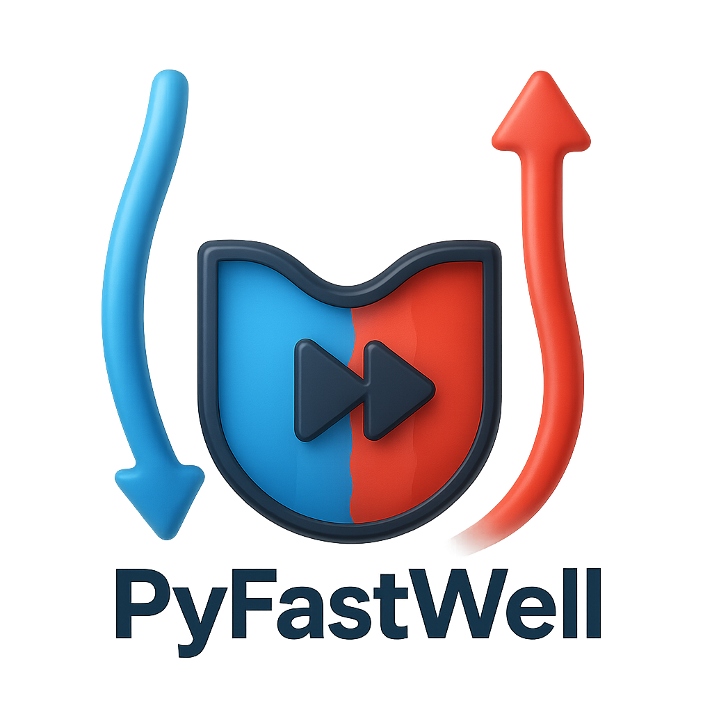

<p align="center">
  
</p>

# Pyfastwell

Pyfastwell is a Python package for performance analysis of geothermal energy projects. 

## Features

- Calculate geothermal well performance for advanced well architectures based on a advanced Analytical Element Method (AEM)
- Model well trajectories and deviations
- Flexible configuration via YAML files
- Extensible API for custom workflows
- Documentation and tests included

### Reference in the literature

The Pyfastwell is based on the AEM model and analytical models as described in:

Fokker, P. A., Verga, F., & Egberts, P. J., 2005 *New semianalytic technique to determine horizontal well productivity index in fractured reservoirs. SPE Reservoir Evaluation & Engineering, 8(02), 123-131.*

Egberts, P., Shatyrbayeva, I., Fokker, P.A., 2013. *Well inflow modelling for wells not aligned to a numerical grid. SPE 165986.*

Van Wees, J. D., Kronimus, A., Van Putten, M., Pluymaekers, M., Mijnlieff, H., Van Hooff, P., Obdam, A., & Kramers, L., 2012. *Geothermal aquifer performance assessment 


Barros, E.G.D.; Szklarz, S.P.; Khoshnevis Gargar, N.; Wollenweber, J.; van Wees, J.D. Optimization of Well Locations and Trajectories: Comparing Sub-Vertical, Sub-Horizontal and Multi-Lateral Well Concepts for Marginal Geothermal Reservoir in The Netherlands. Energies 2025, 18, 627. [DOI](https://doi.org/10.3390/en18030627)

## Installation

Install the latest version using pip:

```sh
pip install pyfastwell
```

## Optional Dependencies

- **Documentation:**  
  To build and view the documentation, install with the `docs` extra:
  ```sh
  pip install pyfastwell[docs]
  ```
- **Testing:**  
  To run tests, install with the `tests` extra:
  ```sh
  pip install pyfastwell[tests]
  ```
  
## Contributing

Contributions are welcome! Please open issues or submit pull requests.

## License

GNU General Public License v3 (GPLv3)

## Contact information

Jan-Diederik van Wees (jan_diederik.vanwees@tno.nl)

## Acknowledgements

This study has been performed as part of the RESULT project (Enhancing REServoirs in Urban deveLopmenT: smart wells and reservoir development). [RESULT](https://www.result-geothermica.eu/home.html) has been subsidized through the ERANET Cofund GEOTHERMICA (EC Project no. 731117), by the Ministry of Economic Affairs and Climate Policy (the Netherlands), Rannis (Iceland) and GSI (Ireland).

<p float="left">
  
  
</p>

---

For more information, see the [API Reference](docs/index.md) or contact the maintainers.