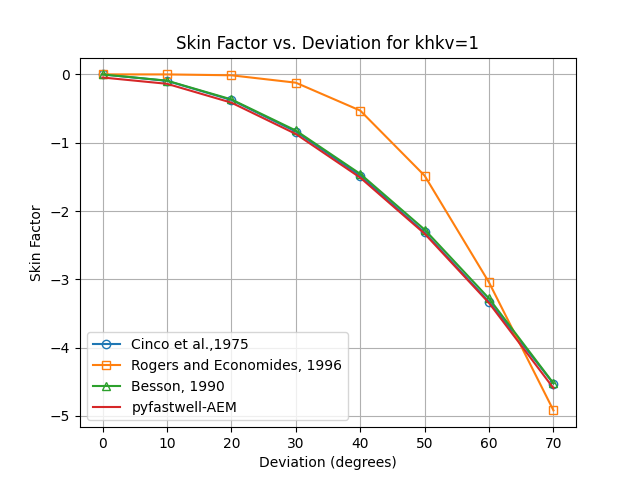
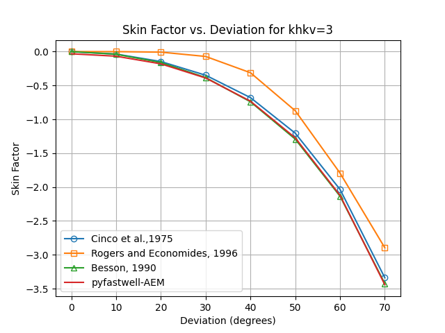
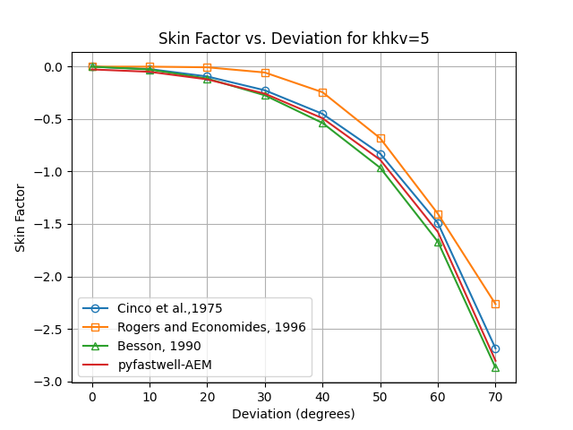
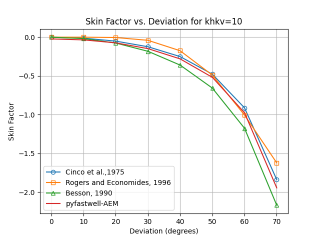
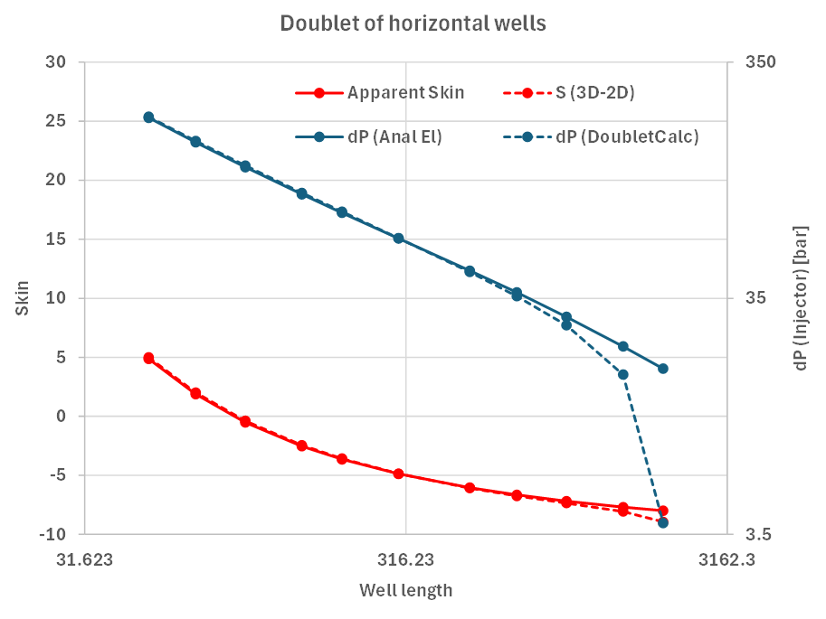
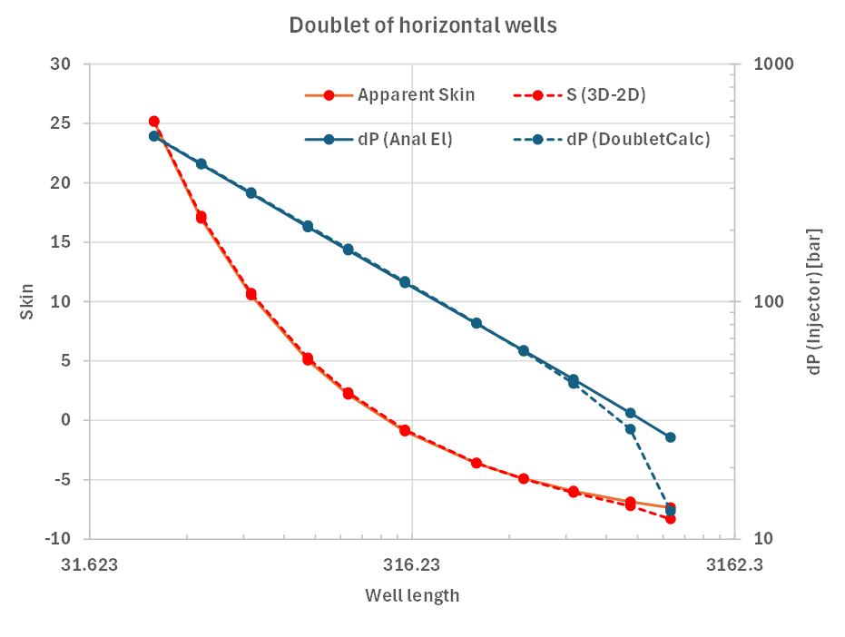

# Analytical Element Method (AEM) model benchmark

The AEM implementation has been tested against doubletcalc1D, the analytical solution thiems
for a doublet with vertical wells in a homogeneous reservoir (Van Wees et al., 2012).

In addition, the AEM implementation has been benchmarked against 
analytical  solutions of for deviated wells in homogeneous reservoirs by:
- Cinco et al. (1975) 
- Rogers and Economides (1996)
- Besson (1990) 

and against the NLOG spreadsheet based on Egberts and Fokker (2001) for horizontal wells in homogeneous reservoirs.

## Thiem's solution for multiple wells in a homogeneous reservoir

The steady state pressure conditions at distance r from the well radius is given by Thiem’s solution for an infinite aquifer:

$p(r) = \frac{\mu q}{2 \pi k H} ( \ln\left(\frac{r}{r_w}\right) + S)$  (eq. 1)

The pressure differences can be superposed for N wells. For a doublet configuration, the system of equations reduces to the well-known steady state solution (e.g. Van Wees et al., 2012):

$\Delta p = \frac{\mu_i q}{ 2\pi k H} ( \ln\left( \frac{L}{r_i} \right) + S_i) +  \frac{\mu_p q}{ 2 \pi k H} ( \ln\left( \frac{L}{r_p} \right) + S_p)$ (eq. 2)

where 

$r_i$ and $r_p$ are the well radii of the injector and producer respectively. 
$S_i$ and $S_p$ are the skin factors of the injector and producer respectively.
$mu_i$ and $mu_p$ are the viscosities at the injector and producer respectively.

  *FIGURE 1: Comparison of AEM model results with Thiem's solution
and DoubletCalc1D for a doublet with vertical wells in a homogeneous reservoir with top reservoir at 2300 m depth and thickness of 100 m. Skins are set to 0.
The viscosity is temperature and salinity dependent according to Van Wees et al. (2012).
This figure can be reproduced with the corresponding unittest in *test_benchmark_aem.py**

## Deviated wells in homogeneous reservoirs

In three dimensions we tested the a progressively inclined well, with deviations from vertical from 0 to 70 degrees.
The center of the reservoir is at 2300 m depth, with a thickness of 100 m. the average distance between the perforated sections of the wells is maintained at 1300 m.
For a well with 0 degrees deviation, the results are compared with Thiem's solution and DoubletCalc1D for a doublet with vertical wells in a homogeneous reservoir according to eq. 2.
For increasing deviation from vertical, the AEM results are backbalculated to equivalent skin to a vertical which are required to obtain the same PI and II as the AEM results.
they are compared to the analytical solutions from Cinco et al. (1975), Rogers and Economides (1996), and Besson (1990).

  
*FIGURE 2: Comparison of AEM model results for varying deviations for khkv=1 (Horizontal to vertical permeability ratio). For 0 degrees results are compared
with Thiem's solution and DoubletCalc1D for a doublet with vertical wells in a homogeneous reservoir according to eq. 2. Well Skins are set to 0.
The viscosity is temperature and salinity dependent according to Van Wees et al. (2012). For increasing deviation from vertical, 
the AEM results are compared with the analytical solutions described in the paragraph.  
This figure can be reproduced with the corresponding unittest in *test_benchmark_aem.py**

  
*FIGURE 3: Comparison of AEM model results for varying deviations for khkv=3 (Horizontal to vertical permeability ratio)*

  
*FIGURE 4: Comparison of AEM model results for varying deviations for khkv=5 (Horizontal to vertical permeability ratio)*

  
*FIGURE 5: Comparison of AEM model results for varying deviations for khkv=10 (Horizontal to vertical permeability ratio)*

## horizontal wells in homogeneous reservoirs

For horizontal wells, relations are used that are based on the 3D-2D transition method that was developed by Egberts and Fokker (2001)., and available as spreadsheet tool at nlog. 
Possible permeability anisotropy is taken into account in this expression.We focus the comparison of the pressure on the injection well. The general input parameters our simulations are a viscosity of 0.817 mPa.s; an injection rate of 400 m3/hr; 
a horizontal permeability of 100 md; a well radius of 0.1 m and an aquifer thickness of 100 m at a depth between 2300 and 2400 m. 
In a first sensitivity exercise, we position two parallel horizontal wells at a distance of 1000 m. The length of the two wells is varied between 50 and 2000 m. 
We made a comparison between the two tools for a vertical permeability of 100 md (isotropic case) and 10 md (anisotropic case with kv/kh=0.1). 
We provide both the pressure difference between fluid in the well and the far-field aquifer pressure, and the skin. The apparent skin resulting from the pyfastwell calculations 
is determined by adjusting it so the analytical equation for a vertical well doublet with skin equals the pyfastwell output. Figure 6 gives the results of the comparisons. 
We see that the approximation breaks down for well lengths equal to or longer than the distance between injection and production well – 1000 m in this case. Below that value, the agreement is excellent. 

  
*FIGURE 6: Comparison of AEM model results for horizontal wells for varying lengths for khkv=1  (Horizontal to vertical permeability ratio). 
Comparison of calculations with effective skin based on the NLOG spreadsheet (Egberts and Fokker, 2001) (symbols and dashed lines) and Analytic Elements calculations (symbols and full lines).*

  
*FIGURE 7: Comparison of AEM model results for horizontal wells for varying lengths for khkv=10  (Horizontal to vertical permeability ratio). 
Comparison of calculations with effective skin based on the NLOG spreadsheet (Egberts and Fokker, 2001) (symbols and dashed lines) and Analytic Elements calculations (symbols and full lines).*

##  equivalent Skin for Doubletcalc1D

The resulting PI and II can be compared to a reference simple well layout (i.e. vertical, not laterals, following cf. DoubletCalc). To this end
the [Wellfastmodel](../../api/wellflow/WellFastModel.md) can be used to calculate the equivalent skin factor for a vertical well which would give the same PI and II as the AEM model.
see the examples in the examples folder

## References

1. Fokker, P. A., Verga, F., & Egberts, P. J., 2005 *New semianalytic technique to determine horizontal well productivity index in fractured reservoirs. SPE Reservoir Evaluation & Engineering, 8(02), 123-131.*
2. Egberts, P., Shatyrbayeva, I., Fokker, P.A., 2013. *Well inflow modelling for wells not aligned to a numerical grid. SPE 165986.*
3. Egberts, P. J. P., & Fokker, P. A., 2001. *A new analytical approximation for the flow into a well in a finite reservoir. Transport in porous media, 44(1), 85-107.*
4. Van Wees, J. D., Kronimus, A., Van Putten, M., Pluymaekers, M., Mijnlieff, H., Van Hooff, P., Obdam, A., & Kramers, L., 2012. *Geothermal aquifer performance assessment 
for direct heat production–Methodology and application to Rotliegend aquifers. Netherlands Journal of Geosciences 91 (04): 651-665.*
5. CH. Cinco, F.G. Miller, H.J. Ramey Jr., 1975. *Unsteady-state pressure distribution created by a directionally drilled well. J. Petrol. Technol., 27 (11) (1975), pp. 1-392*
6. E.J. Rogers, M.J. Economides, 1996.  *The skin due to slant of deviated wells in permeability-anisotropic reservoirs International Conference on Horizontal Well Technology, Society of Petroleum Engineers*
7. Besson H., 1990. *Performance of slanted and horizontal wells on an anisotropic medium. European Petroleum Conference, Society of Petroleum Engineers (1990)*

