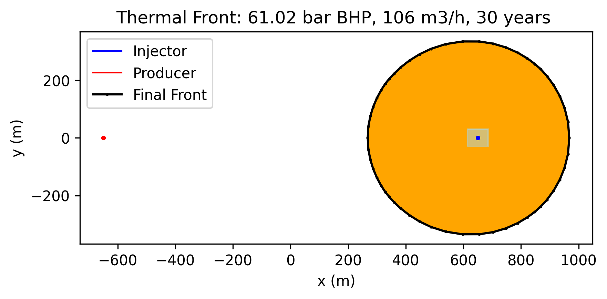
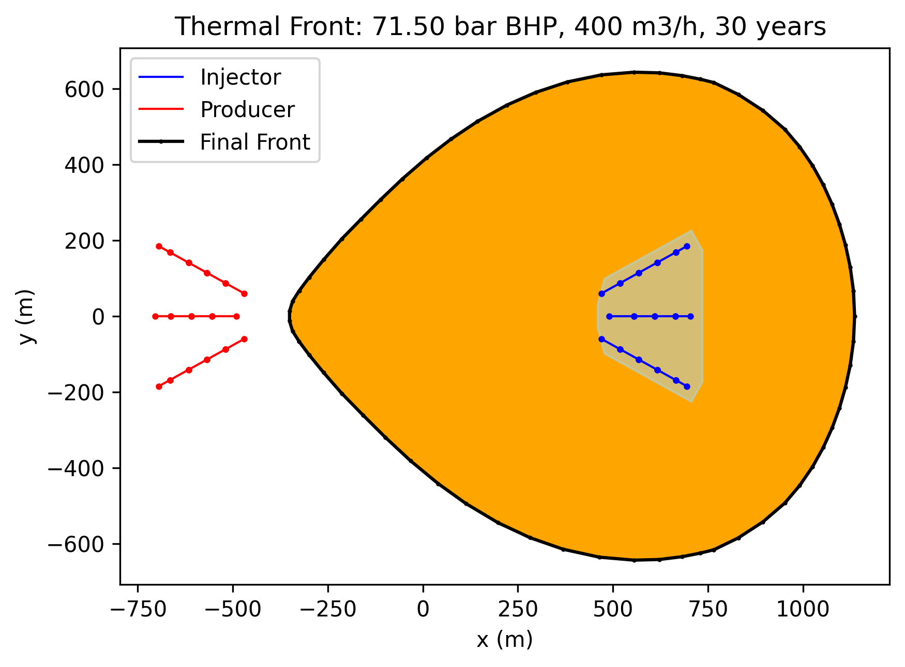
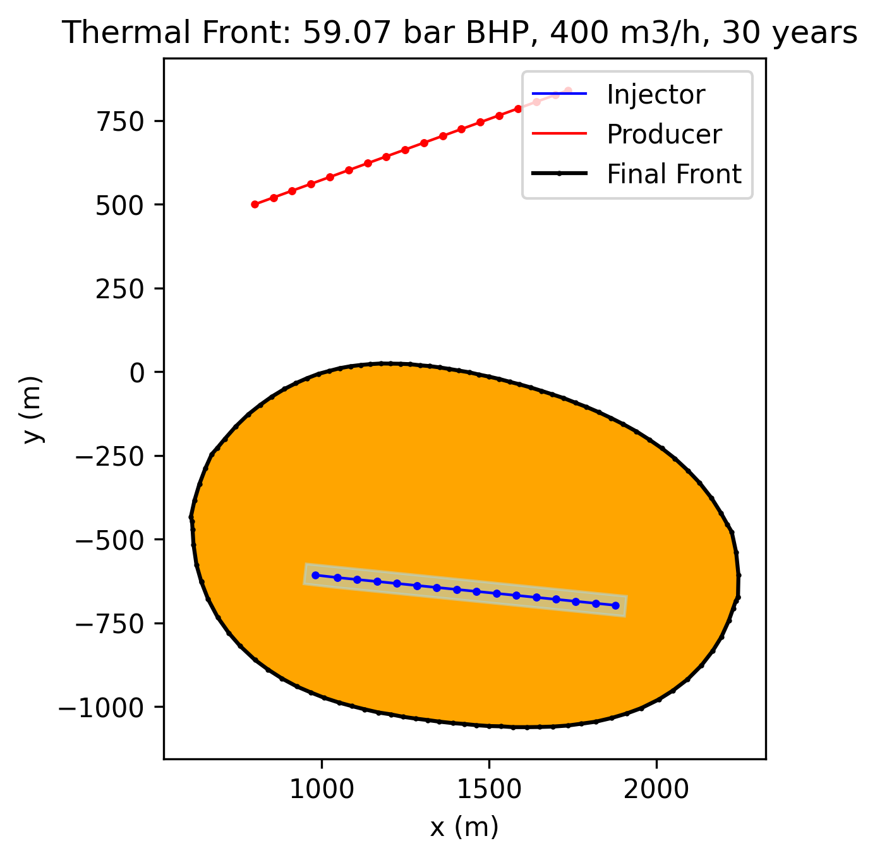

#  coldfront tracking in the reservoir, based on finite difference solution

## introduction

pyfastwell allows to trace the coldfront evolution in the reservoir, based on a finite difference solution.

It traces the coldfront in 2D, using as input the inflow and outflow calculated by the AEM model, reservoir properties, and thermal properties of the fluid.

It does not take into account thermal diffusion

It allows to visually inspect the coldfront evolution in the reservoir

The coldfront tracking is implemented in the `ColdFront` class in the `pyfastwell.coldfront` module.

The coldfront tracking is based on a finite difference solution, using a grid in the reservoir.
The coldfront tracking is based on the following assumptions:
- The reservoir is homogeneous and isotropic
- The flow is steady state
- The coldfront is sharp
- The coldfront is tracked in 2D

## Cold Front tracking for a vertical well doublet
An example of a coldfront tracking for a vertical well doublet is shown in the figure below.
Its is based on the benchmark case described in the [AEM benchmark](aemmodel/aem_benchmark.md) section.

  
*FIGURE 1: Coldfront evolution in the reservoir for a vertical well doublet. The coldfront is tracked in 2D, using a grid in the reservoir. The coldfront is shown at different time steps, from 0 to 20 years. The coldfront is sharp, and the temperature is constant behind the coldfront. The coldfront is tracked in 2D, using a grid in the reservoir.  The coldfront is sharp, and the temperature is constant behind the coldfront. 
This figure can be reproduced with the corresponding unittest in *test_fastmodel.py* for the welltrajectory input from inputXYZvertical.yml*

## Cold Front tracking for a multi-lateral well doublet

An example of a coldfront tracking for a multi-lateral well doublet is shown in the figure below.

 *FIGURE 2: Coldfront evolution in the reservoir for a multi-lateral well doublet with 3 legs. The coldfront is tracked in 2D, using a grid in the reservoir. The coldfront is sharp, and the temperature is constant behind the coldfront. 
This figure can be reproduced with the corresponding unittest in *test_fastmodel.py* for the well trajectory input from inputsMultilateral3legsDetailed.yml*

## Cold Front tracking for horizontal well doublet

An example of a coldfront tracking for a horizontal well doublet is shown in the figure below.

 *FIGURE 2: Coldfront evolution in the reservoir for a multi-lateral well doublet with 3 legs. The coldfront is tracked in 2D, using a grid in the reservoir. The coldfront is sharp, and the temperature is constant behind the coldfront. 
This figure can be reproduced with the corresponding unittest in *test_fastmodel.py* for the well trajectory input from inputsMultilateral3legsDetailed.yml*