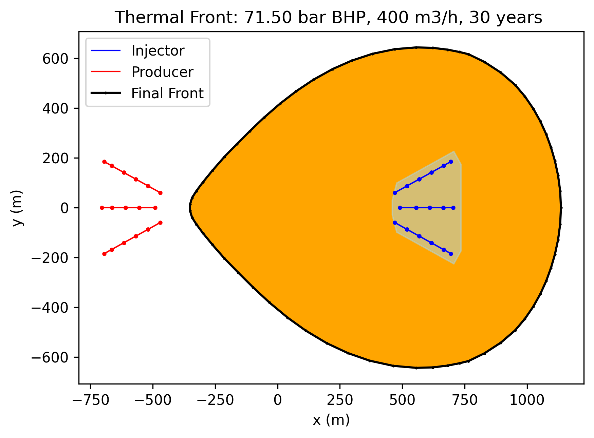

#  Using pywellfast for geothermal doublet performance assessment

## steps to perform a geothermal doublet performance assessment

The following steps are typically involved in performing a geothermal doublet performance assessment using pyfastwell:

1. **Define the well architecture**: Create a well trajectory file that describes the geometry and layout of the injection and production wells. This file should be in accordance with the supported well types in `pywellgeo`.
2. **Define simulation parameters**: Create a setting file that contains the simulation parameters, including reservoir properties, fluid properties, and economic parameters. This file should be in YAML format.
3. **Initialize the economics instance and fastmodel**: Use the `GeothermalEconomics` class from `pythermonomics` to initialize the economic model based on the setting file and well trajectory file. Then, create an instance of the `WellFastModel` class from `pyfastwell`, providing the economics instance and reservoir properties.
4. **Set operational parameters such as BHP and compute results**: Set the bottom hole pressure (BHP) for the wells and compute the economic performance using the `compute_economics` method of the `WellFastModel` instance.
6. **compute performance and analyze results**


## required input files

- define the well architecture with a [well trajectory file](welltrajectory/index.md) 
in accordance to supported well types `pywellgeo` 
- define the simulation parameters in a [setting file](#defining-simulation-parameters-with-a-settingfile)

### defining-simulation-parameters-with-a-settingfile
The settingfile is a yaml file which contains the simulation parameters, except for the well architecture, which is defined in the trajectoryfile.
An example of a settingfile is shown below. More explenation of the parameters can be found in the pythermonomics documentation
The reservoir_simulation_parameters production_temperature, injection_BHP, production_BHP and flow rate can be modified later in the
WellFastmodel class.

The well_trajectories section is ignored by pywellfast, but is required to parse the file with pythermonomics.

```yaml
energy_loss_parameters:
  well_roughness: 1.38
  well_tubing: 7
  useheatloss: true
  tsurface: 10.0
  tgrad: 0.031

reservoir_simulation_parameters:
  injection_temperature: 50
  production_temperature: 90
  injection_BHP: 260
  production_BHP: 200
  flowrate: 400
  salinity: 140000

techno_economic_parameters:
  loadhours: 6000
  wellcost_scaling: 1.5
  wellcost_base: 250000
  well_curvfac: 1.0
  wellcost_linear: 700
  wellcost_cube: 0.2
  pump_efficiency: 0.6
  pump_cost: 500000
  pump_life: 5
  CAPEX_base: 3000000
  CAPEX_variable: 300
  CAPEX_contingency: 0.15
  OPEX_base: 0
  OPEX_variable: 100
  OPEX_variable_produced: 0.19
  equity_share: 0.2
  loan_nyear: 15
  loan_rate: 0.05
  discount_rate: 0.145
  inflation_rate: 0.015
  tax_rate: 0.25
  tax_depreciation_nyear: 15
  heat_price: 5.1
  heat_price_feedin: 5.1
  electricity_price: 8
  lifecycle_years: 15
  subsidy_years: 15

well_trajectories:
  INJ1:
    platform: [0, 0, 0.0]
    kick_off: [0, 0, 800.0]
    targets: [[800, 500, 2300], [1800, 500, 2400]]
  PRD1:
    platform: [0, 0, 0.0]
    kick_off: [0, 0, 800.0]
    targets: [[800, -500, 2300], [1800, -500, 2400]]
```

## initializing the economics instance and fastmodel

```python
import pyfastwell as pwf
from pythermonomics.geothermal_economics import GeothermalEconomics
settingfile = "path/to/your/settingfile.yml"
trajectoryfile = "path/to/your/welltrajectoryfile.yml"
economics = GeothermalEconomics.from_trajectory(settingfile, trajectoryfile)
fastmodel = pwf.WellFastModel(economics, k=100, khkv=1, segmentlength=50, verbose=False)
```

The k (permeability in mDarcy) and khkv (horizontal to Vertical permeability Ratio) parameters define the reservoir properties, and can be modified later.
The segmentlength parameter defines the discretization of the well trajectory in the AEM. smaller numbers result in significantly more
computational time, but more accurate results. A value of 50 m is a good compromise between accuracy and speed for most well trajectories.

The verbose parameter can be set to True to get more detailed output during the calculations.

The trajectoryfile can be two formats : "DETAILEDTNO" or "XYZGENERIC", see the [well trajectory documentation](welltrajectory/index.md) for more information.

If its format is "DC1DWELL", you should use another constructor for the economics instance:
```python
from pywellgeo.well_data.dc1dwell import *
dc1dwell = Dc1dwell.from_configfile(dc1dsettings)
dc1dwell.qvol =   -125/3600
dc1dwell.dp = 30
dc1dwell.calculateDP_qvol()
economics = GeothermalEconomics.from_dc1d(settingfile, dc1dsettings, dc1dwell)
```
This sets the qvol in accordance to the dp. If qvol is set positive, it will use the flowrate to calculate the dp.

## setting BHP and  computation 

```python
fastmodel.set_dP_BHP(60)
npv, lcoe_val, cashflow, simdata, wells, well_results, cop, power, Tsurface, DT_eff, DP_eff = fastmodel.compute_economics()
print(f"NPV {npv}, LCOE {lcoe_val}, COP {cop}, Power {power} MW, Treservoir {fastmodel.production_temperature} C, Tsurface {Tsurface} C, DT_eff {DT_eff} C, DP_eff {DP_eff} bar")
print(f"Well cost {cashflow['wellcosts'].iloc[0]/1e6} MEUR")
```

## plotting trajectories 

for visualization purposes, the well trajectories can be plotted in 3D and in plan view:

```python
fastmodel.plot_trajectories()
```

For the trajectory file corresponding to a multilateral well with 3 legs for both injector and
horizontal producer as shows defined 


## calculating and plotting the coldfront

The coldfront can be calculated and plotted with the following code:

```python
fastmodel.run_coldfront(simyears=30, rockdens=2700.0, rockcap=1000.0, porosity=0.21)
fastmodel.plot_coldfront()
```

The figure generated by the above code will look like this:


## calculating the equivalent skin factor for Doubletcalc1D

The equivalent skin factor for Doubletcalc1D can be calculated with the following code:

```python
L= 1300
dia_inch = 8
rw = dia_inch * 0.0254  * 0.5
skin_inj, skin_prd, ratio = fastmodel.getSkinFactors_dc1d(L, rw)
print(f"for use in DC1D with L ={L} [m]  and diameter={dia_inch} [inch] Skin factors: inj {skin_inj}, prd {skin_prd}, ratio {ratio}")
```