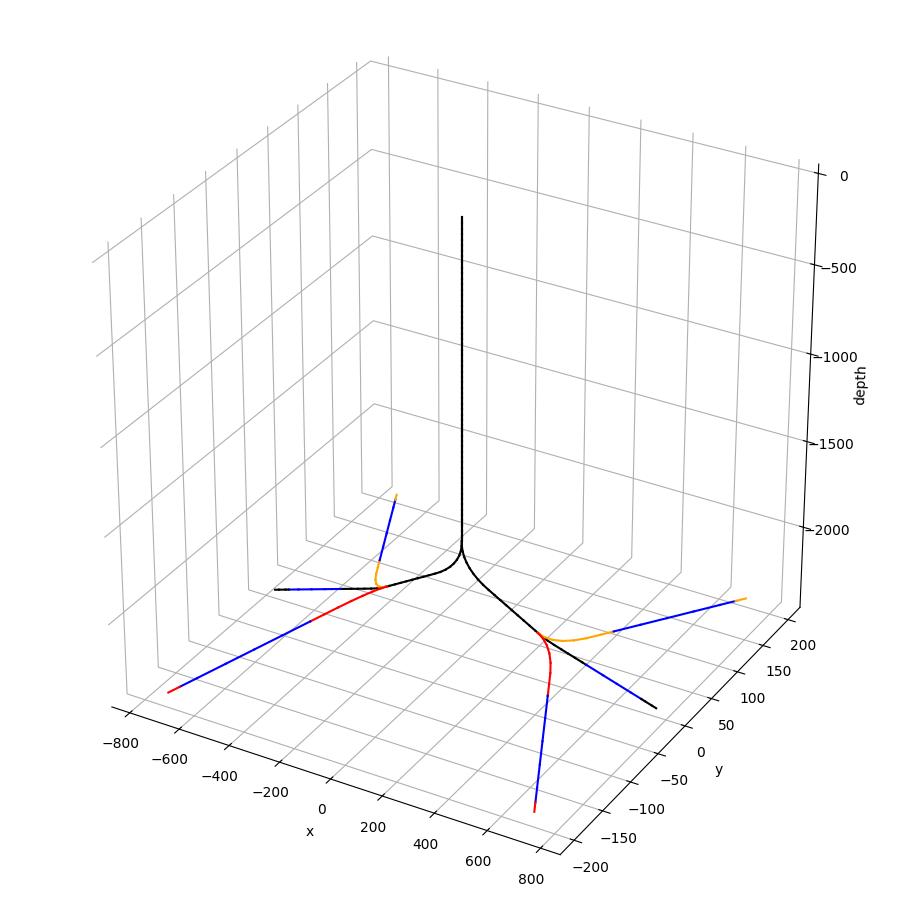
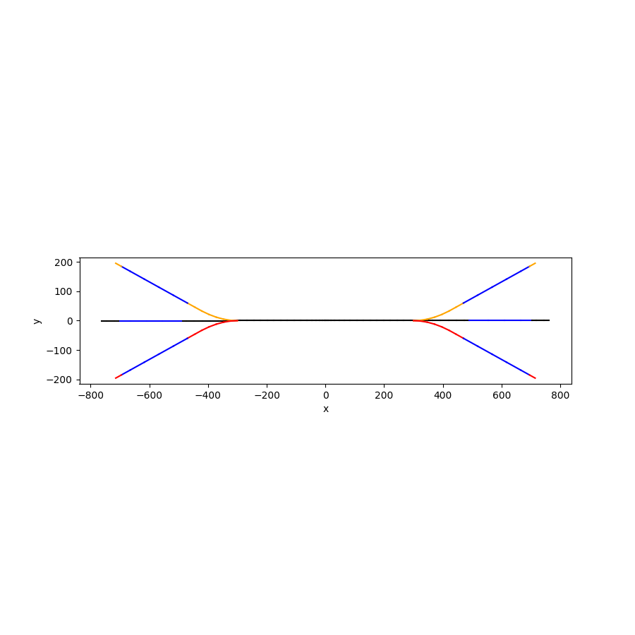
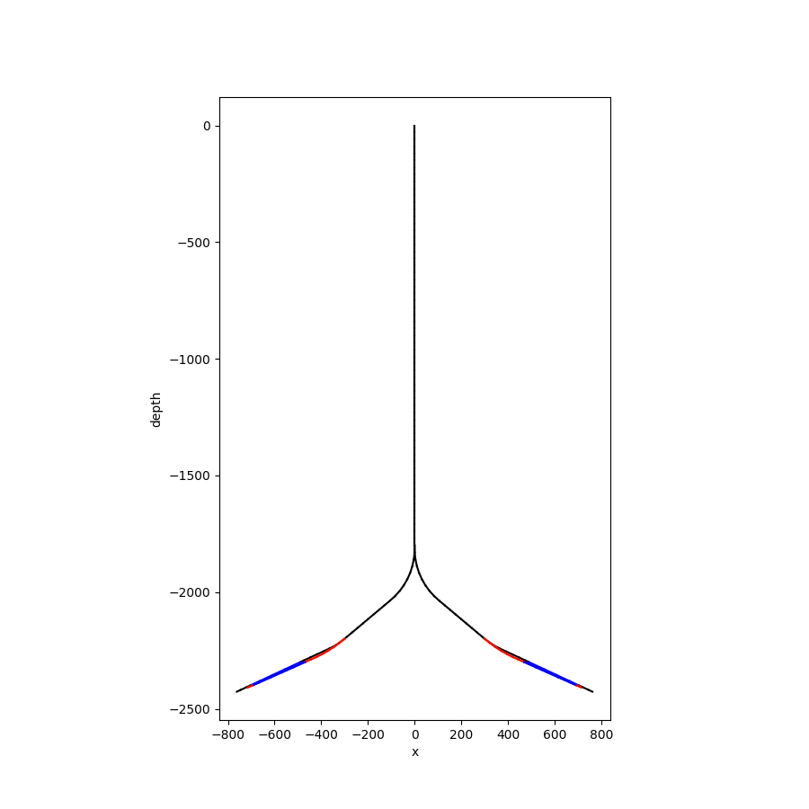
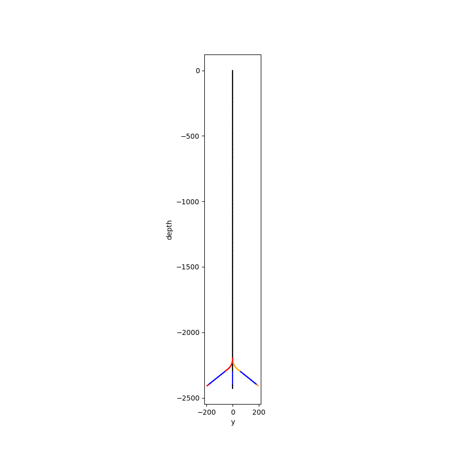

#  pyfastwell stochastic dc1d 
#  ================================

There is an example of


## DETAILEDTNO format

trajectory file as shown below (corresponding to a multilateral well with 3 legs for both injector and producer):

```yaml
format: "DETAILEDTNO"

reservoir:
    basic:
        top_reservoir_depth_TVD: 2300 # m TVD
        bottom_reservoir_depth_TVD: 2400  # m TVD


well_trajectories:
    INJ1:
        main_wellbore:
          name: well1
          wellhead:
              x: 0
              y: 0
          BUR: 6.0 # deg/30m
          radius: 0.1
          subs:
            sub1:
                x: 300 # for x,y omission will take old x,y
                y: 0 # (-TVD)  to be reac
                z: -2200
                azim: 90.0
                dip: 40.0
            sub2:
              dx: 190 # for x,y omission will take old x,y
              y: 0 # (-TVD)  to be reac
              z: -2300
            sub3:
               L: 300
        branch1:
          startsub: sub1 # reference to a node in main_wellbore
          subs:
            subl1:
              dx: 170  # for x,y omission will take old x,y
              dy: 60  # (-TVD)  to be reac
              z: -2300
            subl2:
              L: 300
        branch2:
          startsub: sub1 # reference to a node in main_wellbore
          subs:
            subl3:
              dx: 170  # for x,y omission will take old x,y
              dy: -60  # (-TVD)  to be reac
              z: -2300
              #azim: 100
            subl4:
              L: 300


    PRD1:
        main_wellbore:
          name: well2
          wellhead:
              x: 0
              y: 0
          BUR: 6.0 # deg/30m
          radius: 0.1
          subs:
            sub1:
                x: -300 # for x,y omission will take old x,y
                y: 0 # (-TVD)  to be reac
                z: -2200
                azim: 270.0
                dip: 40.0
            sub2:
              dx: -190 # for x,y omission will take old x,y
              y: 0 # (-TVD)  to be reac
              z: -2300
            sub3:
               L: 300
        branch1:
          startsub: sub1 # reference to a node in main_wellbore
          subs:
            subl1:
              dx: -170  # for x,y omission will take old x,y
              dy: 60  # (-TVD)  to be reac
              z: -2300
            subl2:
              L: 300
        branch2:
          startsub: sub1 # reference to a node in main_wellbore
          subs:
            subl3:
              dx: -170  # for x,y omission will take old x,y
              dy: -60  # (-TVD)  to be reac
              z: -2300
              #azim: 100
            subl4:
              L: 300
```

The figures generated by the above code will look like this:





